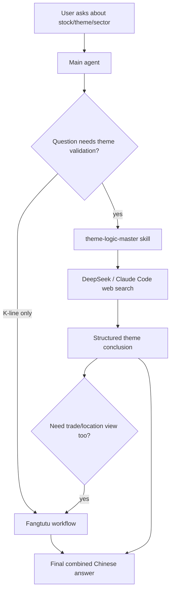

# Theme Logic Master Agent Design

## Summary

The project already has a Fangtutu stock-analysis layer that helps the agent reason about K-line structure, price action, risk control, and trade planning. The new requirement is a separate specialist agent named **Theme Logic Master**. Its job is not to build a local market-data warehouse. Its job is to delegate real-time A-share theme research to the DeepSeek-backed agent with a strict research prompt, then return a structured conclusion that can be combined with Fangtutu's K-line analysis.

The intended outcome is:

- Fangtutu answers: "Can the chart and trade location be acted on?"
- Theme Logic Master answers: "Does this stock belong to a currently hot theme, and which themes/sectors deserve attention now?"
- The main agent combines both views into a disciplined answer.

## Chosen Approach

Use a **DeepSeek web-research delegation workflow** implemented through:

- a project-local Claude skill: `.claude/skills/theme-logic-master/SKILL.md`
- a prompt contract: `docs/theme_logic/prompt_contract.md`
- a lightweight decision graph: `docs/theme_logic/decision_graph.json`
- a Linux loading guide: `docs/theme_logic/LOAD_FOR_AGENT.md`
- updates to `CLAUDE.md` so the main agent knows when to call this workflow and how to combine it with Fangtutu.

This approach wins because the user explicitly prefers not to build and maintain local market-data connectors for this role. A-share theme judgment depends heavily on current market narrative, daily limit-up structure, board rotation, news catalysts, and short-lived sentiment. A carefully constrained DeepSeek web-search prompt is a better first version than shallow local data parsing.

## Non-Goals

This version will not:

- create a local vector database
- create a local knowledge graph
- connect to akshare, Eastmoney, Tonghuashun, or another market-data API for theme logic
- calculate real-time sector rankings inside this repository
- make unconditional buy/sell recommendations

The role is research orchestration and answer discipline, not local data engineering.

## Trigger Scope

The Theme Logic Master should be used when the user asks about:

- whether a stock is part of a current hot theme
- what current A-share themes, sectors, concepts, or industry chains are worth watching
- whether a stock is a theme leader, front-row stock, catch-up stock, back-row stock, or weak concept follower
- current market mainline, branch theme, rotation theme, fading theme, or high-risk theme
- policy, industry, news, earnings, event, or concept catalysts for a stock or sector
- combining theme logic with Fangtutu/K-line analysis

If the user only asks about K-line pattern, stop loss, support, breakout, EMA20, consolidation, or trade management, Fangtutu alone is enough. If the user asks "can this stock be watched/bought" and theme language is relevant, both workflows should be used.

## Required Research Behavior

The Theme Logic Master must ask DeepSeek/Claude Code to perform current web research before answering. The research instruction must force the model to verify facts instead of relying on memory.

Required checks:

1. Identify the market date and whether it is a trading day.
2. Search for current A-share hot themes, sector movers, limit-up clusters, and consecutive-board structure.
3. Search the target stock's current concepts, latest announcements, policy/industry/news catalysts, and same-theme peers.
4. Cross-check important claims with at least two independent sources when possible.
5. Separate facts from inference.
6. Include source names and dates in the answer.
7. Explicitly say when web search is unavailable or the evidence is insufficient.

## Output Contract

The workflow should return Chinese analysis in a stable structure:

```text
题材结论：
是当前热门题材 / 不是当前热门题材 / 存疑，并说明原因。

所属方向：
主线题材 / 支线题材 / 轮动题材 / 退潮题材 / 蹭概念。

个股地位：
龙头 / 前排 / 补涨 / 后排 / 无辨识度 / 暂无法验证。

当前值得关注：
列出 2-5 个当前更值得关注的题材、板块或产业链方向，并说明证据。

验证依据：
列出搜索到的事实、来源名称、日期；区分事实与推断。

风险：
高潮、退潮、后排补跌、消息证伪、板块分歧、监管或流动性风险。

与方土土合并：
题材强 + K线强：重点关注。
题材强 + K线弱：等形态修复或确认。
题材弱 + K线强：降低预期，只看技术反弹。
题材弱 + K线弱：放弃或仅观察。
```

## Decision Graph

The workflow should include a lightweight rule file, not a full knowledge graph. It should stabilize reasoning around common A-share theme situations:

- `hot_theme_front_row`: theme has fresh catalysts, several limit-up stocks, and the target is among the strongest names.
- `hot_theme_back_row`: theme is hot, but the target is weaker than same-theme peers.
- `theme_fading`: previous hot theme is losing limit-up density, leaders are diverging, or late followers are falling.
- `concept_only`: the stock has concept labels but no current price or news confirmation.
- `policy_catalyst_confirmed`: policy/industry event is current and has market spread.
- `news_without_market_response`: news exists, but sector/peer response is weak.
- `unknown_due_to_search_gap`: web evidence is insufficient or unavailable.

The decision graph is not a mechanical score. It gives the agent a repeatable vocabulary for conclusion, implication, and risk action.

## Data Flow



## Integration With Fangtutu

The two agents must have separate ownership:

- Theme Logic Master should not explain K-line structure unless it is summarizing how theme strength affects attention level.
- Fangtutu should not decide whether a concept is currently hot unless current evidence is supplied.
- The main agent combines them only after each specialist gives its own conclusion.

Combined decision matrix:

| Theme Logic | Fangtutu K-line | Final stance |
|---|---|---|
| Strong | Strong | Priority watch, define invalidation first |
| Strong | Weak | Wait for repair, signal bar, or follow-through |
| Weak | Strong | Treat as technical rebound; lower expectation |
| Weak | Weak | Ignore or observe only |
| Unknown | Strong | Watch only after theme evidence improves |
| Strong | Unknown | Research candidate; do not force trade conclusion |

## Error Handling

- If web search is unavailable, the agent must say it cannot verify current theme heat and should not hallucinate current hot sectors.
- If sources conflict, the agent must describe the conflict and lower confidence.
- If the target stock cannot be mapped to a current theme, classify it as `暂无法验证` rather than forcing a concept.
- If the user asks for intraday trading but only delayed information is available, the answer must state the delay risk.

## Testing Strategy

This feature is mostly prompt and agent-orchestration behavior, but the repository should still add lightweight tests around the local artifacts:

- validate `docs/theme_logic/decision_graph.json` is valid JSON
- validate each decision rule has required fields: `id`, `name`, `conditions`, `implication`, `risk_action`
- validate `.claude/skills/theme-logic-master/SKILL.md` and `docs/theme_logic/prompt_contract.md` mention web search, source dates, insufficient-evidence fallback, and Fangtutu integration

No external web calls should be required for automated tests.

## Deployment And Linux Loading

After pulling the repository on the Linux agent machine, the user should be able to load the workflow with one sentence:

```text
请读取本仓库的 CLAUDE.md、docs/theme_logic/prompt_contract.md、docs/theme_logic/decision_graph.json，并加载 theme-logic-master skill；之后凡是股票题材、热门板块、主线方向、个股题材地位问题，都先按 Theme Logic Master 工作流让 DeepSeek 联网核验，再输出结构化结论；需要交易位置时再结合 Fangtutu Stock Analysis。
```

This mirrors the existing Fangtutu loading pattern and keeps the workflow portable through Git.

## Open Risks

- DeepSeek web search quality and availability are outside this repository's control.
- Different agent runtimes may expose web search differently. The prompt must explicitly require a "cannot verify" answer if web search is unavailable.
- A-share theme language changes quickly. The decision graph should stay lightweight and editable instead of pretending to be a permanent taxonomy.
- This workflow improves discipline, but it does not replace professional financial judgment or real-time trading systems.

